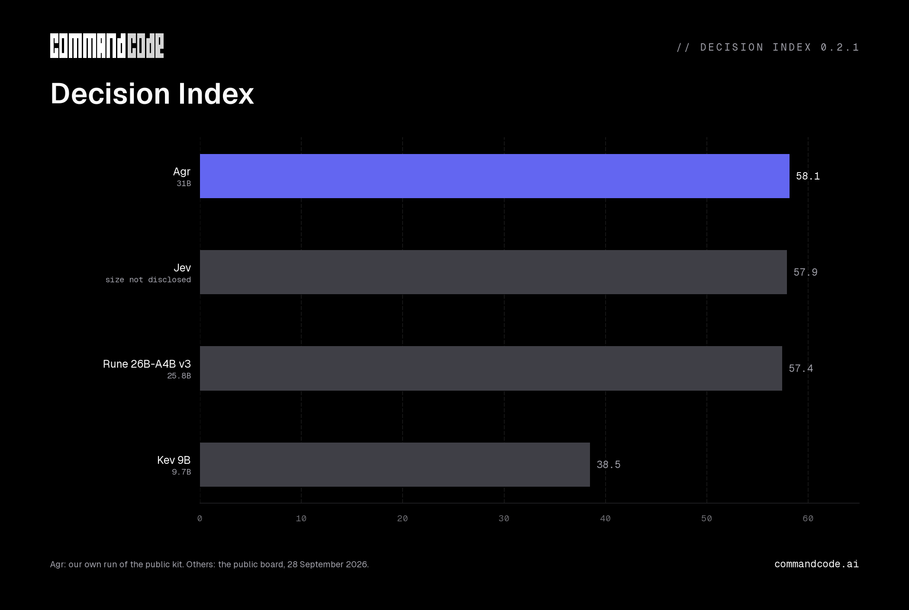
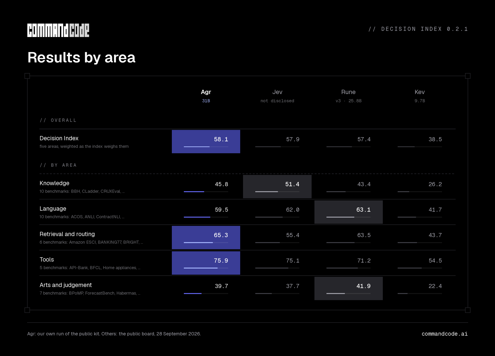
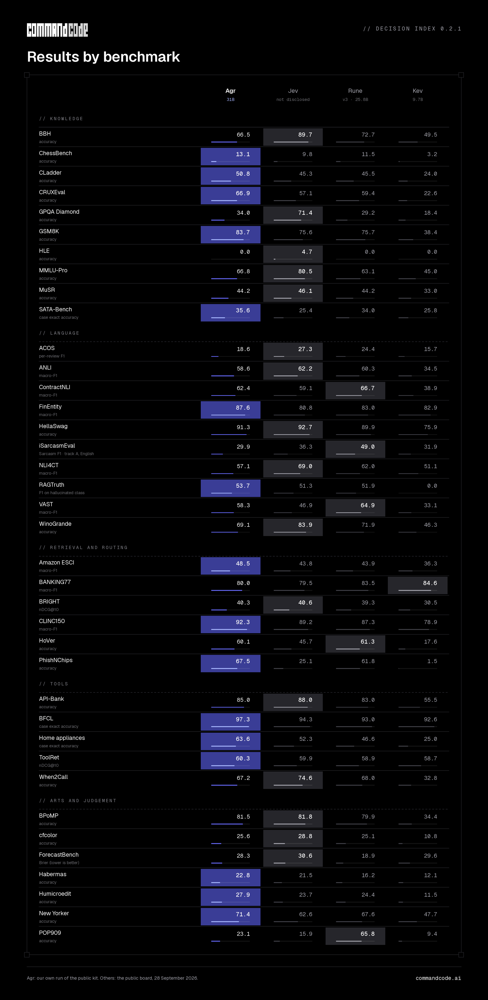

<h1 align="center">Agr</h1>

<p align="center">
  <a href="https://huggingface.co/collections/CommandCode/agr"></a>
  <a href="https://huggingface.co/spaces/multimodalart/jev-decision-index"></a>
  
</p>

Agr is a decision model from Command Code. You send it a state, as text or JSON, with one or more typed questions, and it returns typed answers with a probability for every option.

Agr comes in two sizes, **Agr** and **Agr-flash**. Agr scores 58.15 on Decision Index 0.2.1 across 38 counted benchmarks.

## Why Agr

Decisions like routing a ticket, picking a tool or approving an action have a fixed set of answers. Agr scores those answers directly and returns a probability for each, instead of generating text you have to parse. Every question about the same state is answered in one forward pass, independently of the others.

## Evaluation results



We ran Agr on all 150,759 requests of the public [Decision Index kit](https://github.com/apolinario/decision-index) at revision `87d4650`, with nothing truncated. Jev, Kev and Rune scores come from the public board as of 28 September 2026.

The index averages chance-corrected skill over five areas. The figures show skill × 100, not raw accuracy or F1, and higher is better everywhere, including ForecastBench, where the index turns the Brier score into a skill score. 3% of BRIGHT requests exceed Agr's 32,768-token limit and count as wrong.





## Models

| Model | On disk | Token limits (state / question / request) |
| --- | --- | --- |
| [CommandCode/agr](https://huggingface.co/CommandCode/agr) | 61.43 GB | 16,384 / 16,384 / 32,768 |
| [CommandCode/agr-flash](https://huggingface.co/CommandCode/agr-flash) | 0.73 GB | 6,144 / 2,048 / 12,288 |

Agr-flash is not meant for safety decisions. Each repository holds the weights, tokenizer and config.

## How it works

All questions read the same state, but no question can attend to another. Agr reads each option's score from the model's own output layer; Agr-flash uses a small trained scoring head. Details are in [DESIGN.md](DESIGN.md).

## Quickstart

Agr needs Python 3.11 or newer. Installing it pulls in PyTorch and the Transformers version it was tested with:

```bash
pip install git+https://github.com/CommandCodeAI/agr
```

### Python

The first run downloads the weights from Hugging Face. Agr's bf16 weights are 61.43 GB; we serve it on 96 GB GPUs. For Agr-flash, use `CommandCode/agr-flash`.

```python
from agr.model import Agr
from agr.records import boolean, choice

model = Agr.from_pretrained("CommandCode/agr", device="cuda")
questions = [
    choice(
        "team",
        "Which team should handle this?",
        ["Engineering: technical faults", "Billing: payment disputes"],
    ),
    boolean("urgent", "Does this require immediate attention?"),
]

probabilities = model.probs(
    "Checkout is failing and customers cannot place orders.",
    questions,
)
for question, values in zip(questions, probabilities):
    print(question.qid, dict(zip(question.options, values.tolist())))
```

### Server

```bash
agr serve CommandCode/agr --port 8000
```

The server takes System One requests at `/v1/systemone`. Call it with curl, Python or TypeScript.

#### curl

```bash
curl -s localhost:8000/v1/systemone -H 'content-type: application/json' -d '{
  "model": "agr-latest",
  "state": "Agent wants to run: git push --force origin main\nRepo: shared by 14 people, no branch protection.",
  "questions": {
    "loses_work": {"type": "noul", "instructions": "Could this erase work that other people pushed?"},
    "blast": {"type": "score", "instructions": "Who could this affect if it goes wrong?",
      "criteria": ["Nobody", "Only the person running it", "Everyone who uses the repo"]}
  }
}'
```

#### Python

With the [TypeSafe Python SDK](https://docs.typesafe.ai/sdk/python):

```bash
pip install typesafe-sdk
```

```python
from typesafe_sdk import Choice, Noul, TypeSafeClient

with TypeSafeClient(
    api_key="local",
    base_url="http://localhost:8000",
    model="agr-latest",
) as client:
    result = client.system_one(
        state="Checkout is failing and customers cannot place orders.",
        questions={
            "urgent": Noul(instructions="Does this require immediate attention?"),
            "team": Choice(
                instructions="Which team should handle this?",
                criteria={"engineering": "Technical faults", "billing": "Payment disputes"},
            ),
        },
    )

print(result.nouls["urgent"].noul)
print(result.choices["team"].choice)
```

#### TypeScript

With the [TypeSafe JavaScript SDK](https://docs.typesafe.ai/sdk/javascript) (Node.js 20 or newer):

```bash
npm install @typesafe-ai/sdk
```

```ts
import { choice, noul, TypeSafeClient } from "@typesafe-ai/sdk";

const client = new TypeSafeClient({
  apiKey: "local",
  baseURL: "http://localhost:8000",
  defaultModel: "agr-latest",
});

const { answers } = await client.systemOne({
  state: "Checkout is failing and customers cannot place orders.",
  questions: {
    urgent: noul("Does this require immediate attention?"),
    team: choice("Which team should handle this?", {
      engineering: "Technical faults",
      billing: "Payment disputes",
    }),
  },
});

console.log(answers.urgent.noul);
console.log(answers.team.choice);
```

The server needs no key by default, so the API key can be any string. If you start it with `--api-key` or `AGR_API_KEY`, pass that key.

### Request format

| Field | Description |
| --- | --- |
| `model` | `agr-latest` |
| `state` | Text or JSON describing the situation |
| `questions` | Questions keyed by ID |

Each question has a `type` and `instructions`. The three question types are the System One primitives: a `choice` selects one of several named options, with `criteria` mapping each name to a description; a `score` rates the state on levels listed in order in `criteria`; and a `noul` is a yes/no judgment. Inputs are text only.

| Type | Options | Output |
| --- | --- | --- |
| `noul` | No / yes | Probability of yes |
| `choice` | 2–255 named options | Selected option, probability distribution and confidence |
| `score` | 2–255 ordered levels | Expected level index, probability distribution and confidence |

`confidence` uses System One's definition, which is not the top option's probability.

### Evaluate on your data

```bash
agr eval http://localhost:8000 labelled.jsonl --out agr-results.jsonl
```

It reports accuracy, Brier score, calibration error and latency. The label format and `agr compare` are in [DESIGN.md](DESIGN.md#measuring-it-yourself).

## Limitations

- English text only; images are not supported.
- Answers are limited to the options you supply; there is no generated text or explanation.
- Check probabilities and thresholds on your own labelled examples before relying on them.
- Changing the order of options can change the answer.
- Neither model is a standalone safety filter or fit to be the sole authority for consequential decisions about people.

## Acknowledgements

Agr builds on TypeSafe's Jev and its System One API, and on Archer Hume's analysis of Jev's architecture. It also draws on Jared Palmer's Kev, Mark Marosi's Decider for the answer-slot prompt layout and the temperature rule, and Invergent AI's Surogate for option-order averaging. We thank apolinário and the Decision Index maintainers, Google DeepMind for Gemma, Hugging Face for SmolLM2, and the authors of the datasets we used. Agr is not affiliated with TypeSafe or the systems compared here.

## License

Agr is released under Apache 2.0. Agr uses Google DeepMind's Gemma 4 31B IT; Agr-flash uses Hugging Face's SmolLM2-360M. Both base models are licensed under Apache 2.0. See NOTICE.md for attribution.

© 2026 Command Code
